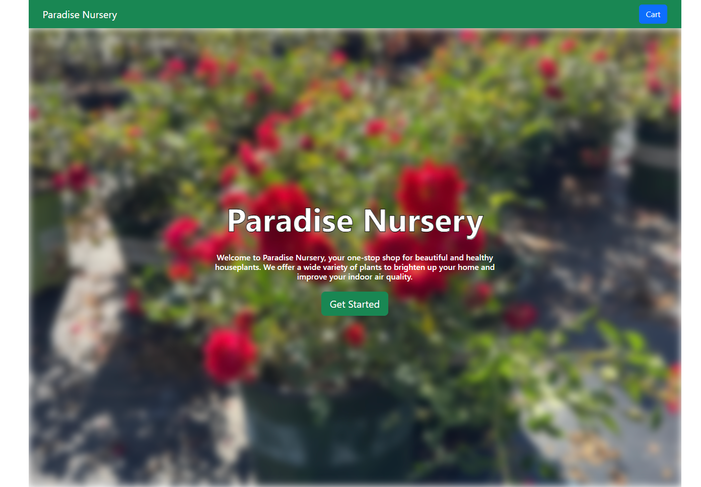
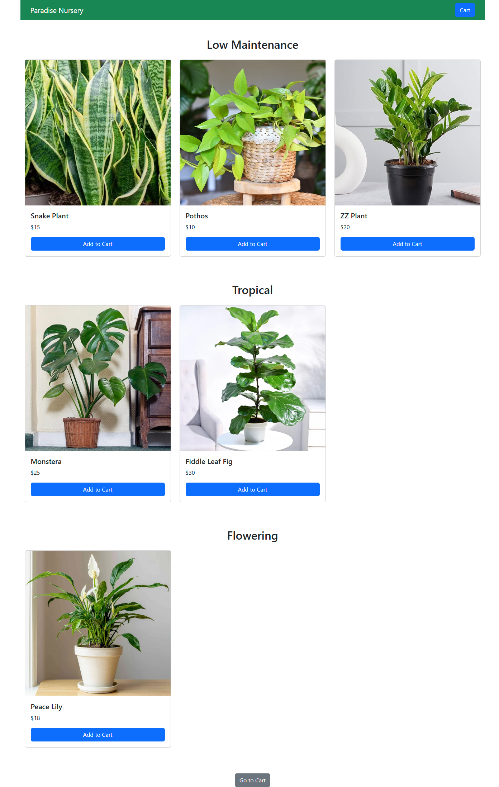
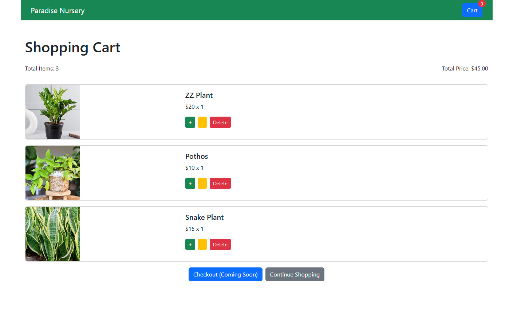

# Paradise Nursery - Houseplant E-commerce App

Paradise Nursery is a React-based e-commerce application built with **Vite** that allows users to browse and purchase houseplants. The app includes features like product categorization, a shopping cart, and responsive design using **Bootstrap**.

Paradise Nursery Screenshots:
_`/`_



---

_`/products`_



---

_`/cart`_



---

## Technologies Used

- **Frontend Framework**: React.js
- **Build Tool**: Vite
- **State Management**: Redux Toolkit
- **Routing**: React Router DOM
- **Styling**: Bootstrap
- **Package Manager**: npm

---

## Installation

1. **Clone the Repository**
   ```bash
   git clone https://github.com/vmcse/paradise-nursery-shopping-cart
   cd paradise-nursery-shopping-cart
   ```
2. **Install Dependencies**
   ```bash
   npm install
   ```
3. **Run the Development Server**
   ```bash
   npm run dev
   ```
4. **Open the App**
   - Navigate to http://localhost:5173 in your browser.
